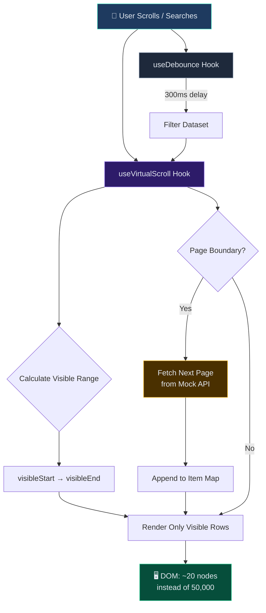

# React Virtual Scroll Demo — Clinical Research Pattern

> Demonstrates the **virtual scrolling and state management patterns** I built for a clinical research platform — rendering 50K+ records efficiently with React hooks and pagination.

## What This Showcases

A self-contained React app demonstrating the frontend patterns from my **Clinical Research & Content Management Platform** — virtual scrolling, debounced search, and paginated API consumption.

### Patterns Demonstrated

| Pattern | Implementation |
|---|---|
| **Virtual Scrolling** | Only renders visible rows — handles 50K+ records smoothly |
| **Backend Pagination** | Fetches data in pages as user scrolls (mock API) |
| **Debounced Search** | Custom `useDebounce` hook for search input |
| **Custom Hooks** | `useVirtualScroll`, `useDebounce`, `usePagination` |
| **State Management** | useReducer for complex multi-field state |

## Architecture



## Running

```bash
npm install
npm run dev
```

Opens at `http://localhost:5174`

## Project Structure

```
src/
├── components/
│   ├── VirtualList.jsx        # Virtual scrolling container
│   ├── SearchBar.jsx          # Debounced search input
│   └── RecordRow.jsx          # Individual record renderer
├── hooks/
│   ├── useVirtualScroll.js    # Core virtual scroll logic
│   ├── useDebounce.js         # Debounce hook
│   └── usePagination.js       # Paginated data fetching
├── data/
│   └── mockApi.js             # Mock API with 50K records
├── App.jsx
└── main.jsx
```
